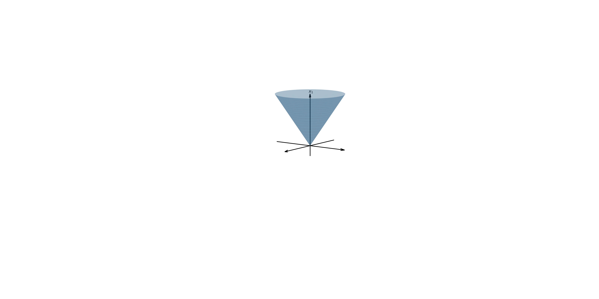
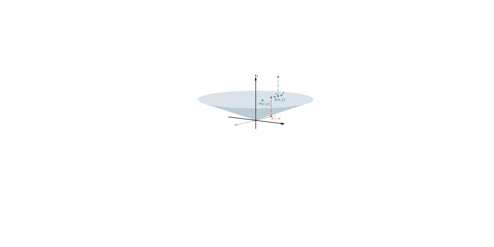

# cone_inequality

### Circular cones

Circular Cone with $\theta\in(0,\dfrac{\pi}{4})$

Circular Cone with $\theta\in(\dfrac{\pi}{4}, \dfrac{\pi}{2})$

### Counterexamples

counterexample of inequality: $x\land y\leq_{\mathcal{L}_\theta}A(x,y)$, where $\theta=\dfrac{\pi}{6}$

counterexample of inequality: $H(x,y)\leq_{\mathcal{L}_\theta}A(x,y)$, where $\theta=\dfrac{\pi}{6}$

counterexample of inequality: $A(x,y)\leq_{\mathcal{L}_\theta}x\lor y$, where $\theta=\dfrac{\pi}{6}$

counterexample of inequality: $H(x,y)\leq_{\mathcal{L}_\theta}A(x,y)$, where $\theta=\dfrac{\pi}{3}$

### Conjecture

adjusted inequality: $H(x,y)\leq_{\mathcal{L}_\theta}TA(x,y)$, 
where $\theta=\dfrac{\pi}{3}$ and $T=\begin{pmatrix}\tan(\theta)&\mathbf{0}\\\mathbf{0}^T&\mathbf{1}\end{pmatrix}$

